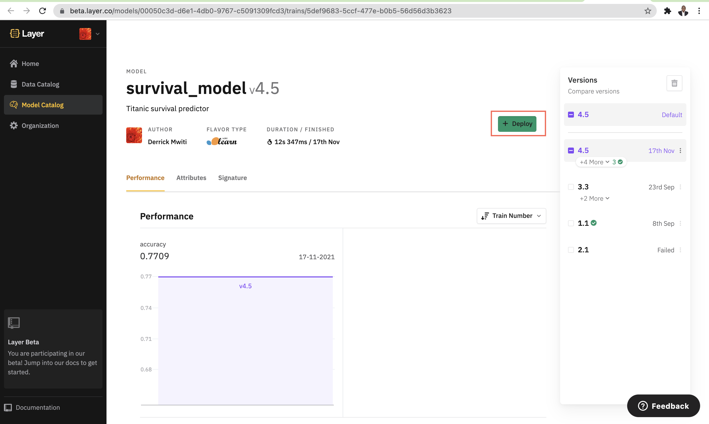
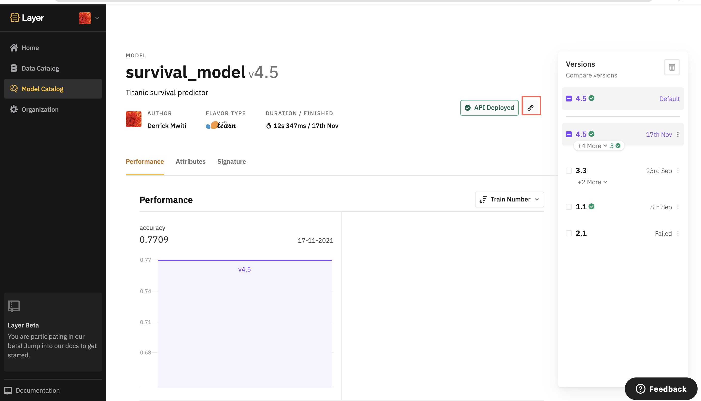
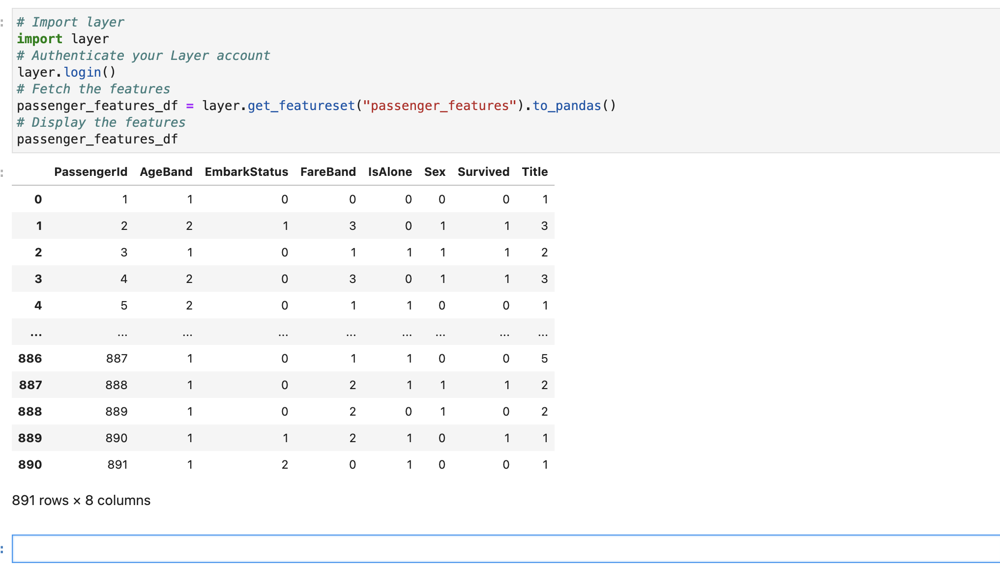

# Layer Example Projects

This repository contains example projects that you can use to get started with [Layer](https://layer.co).

Layer is a declarative MLOps platform to help data teams across all companies produce machine learning (ML) applications based on code. It orchestrates your data pipeline for you. Layer enables you to focus on designing, developing, and deploying models without worrying about the infrastructure

## Install Layer
The first step is to install the [Layer SDK](https://docs.beta.layer.co/docs/installation):
```yaml
pip install layer-sdk
```
## Login to Layer
You need to [log in](https://docs.beta.layer.co/docs/manual/gettingstarted/log-in) before running any [Layer SDK commands](https://docs.beta.layer.co/docs/cli-commands). Enter the following command in the command line.
```yaml
layer login

```
A browser window opens https://beta.layer.co to sign in. If you don't have a Layer account already, you can create one now.
## Clone the examples repository
The next step is to [clone](https://docs.beta.layer.co/docs/cli-commands#clone) this repository:
```yaml
layer clone https://github.com/layerml/examples
```
## Select an example project
Next, select one example project and change into that folder. Let's use the [Titanic example](https://docs.beta.layer.co/docs/quickstart) for illustration: 
```yaml
cd examples/titanic
```
Here is how the folder structure for this project looks like:
```yaml
.
|____.layer
| |____project.yaml                   # Project configuration file
|____models
| |____survival_model
| | |____requirements.txt             # Environment config file
| | |____model.py                     # Source code of the `Survival` model
| | |____survival_model.yaml          # Training directives of our model
|____README.md
|____data
| |____titanic_data
| | |____titanic_data.yaml            # Declares where our source `titanic` dataset is
| |____passenger_features             # feature definitions
| | |____ageband.sql                  # Age Band of the passenger
| | |____fareband.sql                 # Fare Band of the passenger
| | |____title.sql                    # Title of the passenger
| | |____is_alone.sql                 # Is Passenger travelling alone
| | |____survived.sql                 # Survived or not
| | |____passenger_features.yaml      # Declares the metadata of the features above
| | |____embarked.sql                # Embarked or not
| | |____sex.sql                     # Sex of the passenger
|____notebooks
| |____TitanicSurvivalNotebook.ipynb # File showing how to use the generated entities in a notebook
```
## Run the project
Layer projects are [executed on the terminal](https://docs.beta.layer.co/docs/cli-commands#start) using the `layer start` command: 
```yaml
layer start
```
You will see something similar to this on the terminal: 
```yaml
📁 Loading the project under /Users/derrickmwiti/PycharmProjects/Layer-videos/examples/titanic
🔎 Found 1 dataset, 1 featureset and 1 model
📔 Session logs at /Users/derrickmwiti/.layer/logs/20211117T085110-session-42576901-fc60-49d7-9299-3909f19d7da7.log
💾 Starting at 2021-11-17 08:51:13...
🔵 Pipeline run id: 2086c0c2-fab9-4bbc-815c-cf30daa420d0
✅ 2021-11-17 08:51:13 | dataset     titanic                        ━━━━━━━━━━━━━━━━━━━━━━ DONE      [347ms]                                       
✅ 2021-11-17 08:51:15 | featureset  passenger_features             ━━━━━━━━━━━━━━━━━━━━━━ DONE      [34152ms]                                     
                                     https://beta.layer.co/features/420bf9a1-d114-4fed-ba4c-d37abf54e532                                           
✅ 2021-11-17 08:51:50 | model       survival_model                 ━━━━━━━━━━━━━━━━━━━━━━ DONE      [24019ms]                                     
                                     https://beta.layer.co/models/00050c3d-d6e1-4db0-9767-c5091309fcd3/trains/5def9683-5ccf-477e-b0b5-56d56d3b3623 
LAYER RUN SUCCEEDED in 61166ms

```
Layer runs your project and places the generated entities in a [data](https://docs.beta.layer.co/docs/data/data-catalog) and [model catalog](https://docs.beta.layer.co/docs/modelcatalog). 

## Deploying the model 
You can [deploy your model](https://docs.beta.layer.co/docs/quickstart#deploy-your-model) by clicking the Deploy button next to the model in the Model Catalog. 



Once the deployment process is complete, you will get an
API end point that you can use make predictions on the model. 

## Run predictions on the deployed model 
Click the 🔗 icon to copy the deployment URL. You can then use this URL to run predictions on the model: 



```yaml
curl --header "Content-Type: application/json; format=pandas-records" \
  --request POST \
  --data '[{"Sex":0, "EmbarkStatus":0, "Title":0, "IsAlone":0, "AgeBand":1, "FareBand":2}]' \
  $MODEL_DEPLOYMENT_URL
```

The API returns either a [0] or a [1], predicting whether that passenger survived.

## Use the generated entities in a Jupyter Notebook
Entities generated with Layer can also be accessed in a Jupyter Notebook. Layer allows you to access the datasets, feature sets, and models. 

First, let's look at how to access the created features: 
```yaml
# Import layer
import layer
# Authenticate your Layer account
layer.login()
# Fetch the features
passenger_features_df = layer.get_featureset("passenger_features").to_pandas()
# Display the features
passenger_features_df
```
Your results will look something like this:



The model can be accessed using Layer [get_model](https://docs.beta.layer.co/docs/sdk-library/layer-get-model) function:
```yaml
model = layer.get_model("survival_model")
trained_classifier = model.get_train()
trained_classifier
```
The model can be used to make predictions right away: 
```yaml
trained_classifier.predict([[2,2,1,2,1,0]])

```
## Next steps
To learn more about using layer, checkout the [official docs](https://docs.beta.layer.co/docs/). 

You can also join our [community on Slack](https://join.slack.com/t/layer-community/shared_invite/zt-o3cneq4y-5lGSZH~9NhOmBWQB4WAsJw) to learn and engage with other MLOps enthusiasts. 