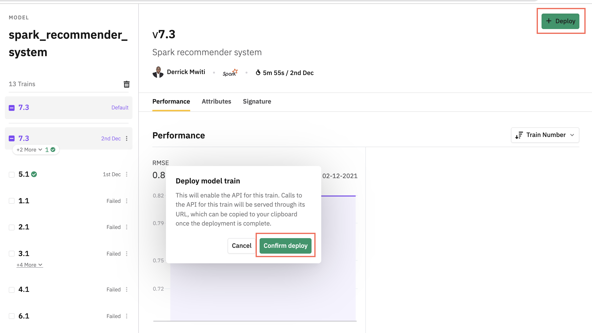
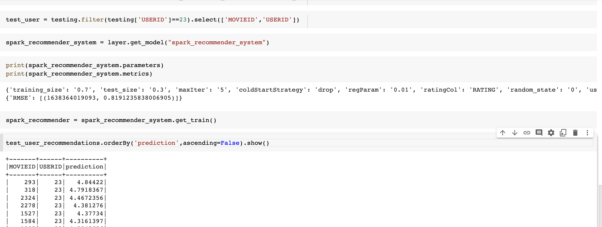
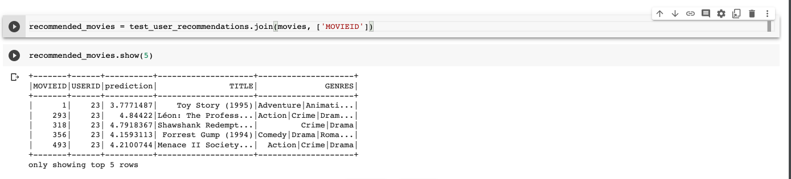

## How to build a recommender system with Layer
On this page you will learn how to build a recommender system with Layer and Spark. The project uses the [MovieLens 20M
Dataset](https://www.kaggle.com/grouplens/movielens-20m-dataset)
provided by [Kaggle](https://www.kaggle.com/). 

The project is organized in the following structure:
```yaml
.
|____requirements.txt
|____images
| |____movies.png
| |____predict.png
| |____deploy.png
|____.layer
| |____project.yaml
|____spark_model.yaml
|____README.md
|____movie_ratings_dataset.yaml
|____notebooks
| |____predictions_with_layer.ipynb
| |____recommender.ipynb
|____spark_model.py

```
### Data definition
In Layer datasets are defined in a `dataset.yaml` file declaring the type as `dataset`. This YAML file
can take any name. In this case, we call it `movie_ratings_dataset.yaml`. Let's look at its contents:
```yaml
# For more information on Dataset Configuration: https://docs.beta.layer.co/docs/datacatalog/datasets

apiVersion: 1

# Unique name of this dataset which will be used in this project to
# refer to this dataset
name: "movie_ratings"
type: dataset

materialization:
    target: layer-public-datasets
    table_name: "rating"

```
Apart from the `type`, the file has the following information: 
- the `name` of the dataset.
- the location of the data as defined by the `target` subkey under the `materialization` key.
- the `table_name`. This is the name of the table in the `layer-public-datasets` data source integration. 

### Spark model definition
Before creating the Spark recommender model, we need to configure it in a `model.yaml` file. In this case, we call this 
file `spark_model.yaml`.The file should declare the
`type` as `model`.  Let's take a look at what this file houses:
```yaml
# Models are created by defining  a `.yaml` with any name and adding `type:model`

apiVersion: 1

# Name and description of our model
name: "spark_recommender_system"
type: model
description: "Spark recommender system"

training:
  name: spark_recommender_system_training
  description: "Spark recommender system training"

  # The source model definition file with a `train_model` method
  entrypoint: spark_model.py
  fabric: "f-spark-large"

  # File includes the required python libraries with their correct versions
  environment: requirements.txt

```
In the file, we define:
- the name and description of the model.
- the name and description of the model training. 
- the file where the model will be created as defined by the `entrypoint` key.
- the type of [fabric](https://docs.beta.layer.co/docs/reference/fabrics) that will be used to train the model. 

The next step is to define the model in the `spark_model.py` file.

#### Fetch the data
Layer models are defined under the `train_model` function. The first step is to fetch the movie ratings data as 
a [Spark DataFrame](https://docs.beta.layer.co/docs/sdk-library/layer-featureset#methods). 

```python
from typing import Any
from layer import Train, Dataset
from pyspark.ml.evaluation import RegressionEvaluator
from pyspark.ml.recommendation import ALS


def train_model(train: Train, ratings: Dataset("movie_ratings"),) -> Any:
    data = ratings.to_spark()
```
#### Split the data into a training and test set
The next step is to split this data into a training and testing set. While at it, we also log the splitting parameters 
via the `train.log_parameters`  method. 
```python
def train_model(train: Train, ratings: Dataset("movie_ratings"),) -> Any:
    data = ratings.to_spark()
    # Split the data into a training and testing set
    training_size = 0.7
    random_state = 0
    test_size = 0.3
    train.log_parameters({
        "training_size": training_size,
        "random_state": random_state,
        "test_size": test_size
    })
    training, testing = data.randomSplit([training_size, test_size], seed=random_state)
```
#### Log model parameters 
Next, let's define the model parameters and log them. In this project, we will use the 
[alternating least squares (ALS)](https://spark.apache.org/docs/3.0.0/ml-collaborative-filtering.html)  
algorithm. Logging the model parameters means that we can compare different models on the model catalog later. 

```python
def train_model(train: Train, ratings: Dataset("movie_ratings"),) -> Any:
    data = ratings.to_spark()
    # Split the data into a training and testing set
    training_size = 0.7
    random_state = 0
    test_size = 0.3
    train.log_parameters({
        "training_size": training_size,
        "random_state": random_state,
        "test_size": test_size
    })
    training, testing = data.randomSplit([training_size, test_size], seed=random_state)
    # Recommendation model using ALS on the training data
    # model parameters
    maxIter = 5
    regParam = 0.01
    userCol = "USERID"
    itemCol = "MOVIEID"
    ratingCol = "RATING"
    coldStartStrategy = "drop"
    train.log_parameters({
        "maxIter": maxIter,
        "regParam": regParam,
        "userCol": userCol,
        "itemCol": itemCol,
        "ratingCol": ratingCol,
        "coldStartStrategy": coldStartStrategy
    })
```
#### Define and train the model 
The next step is to instantiate the ALS algorithm and fit it to the training data. 
```python
from typing import Any
from layer import Train, Dataset
from pyspark.ml.evaluation import RegressionEvaluator
from pyspark.ml.recommendation import ALS


def train_model(train: Train, ratings: Dataset("movie_ratings"),) -> Any:
    data = ratings.to_spark()
    # Split the data into a training and testing set
    training_size = 0.7
    random_state = 0
    test_size = 0.3
    train.log_parameters({
        "training_size": training_size,
        "random_state": random_state,
        "test_size": test_size
    })
    training, testing = data.randomSplit([training_size, test_size], seed=random_state)
    # Recommendation model using ALS on the training data
    # model parameters
    maxIter = 5
    regParam = 0.01
    userCol = "USERID"
    itemCol = "MOVIEID"
    ratingCol = "RATING"
    coldStartStrategy = "drop"
    train.log_parameters({
        "maxIter": maxIter,
        "regParam": regParam,
        "userCol": userCol,
        "itemCol": itemCol,
        "ratingCol": ratingCol,
        "coldStartStrategy": coldStartStrategy
    })
    # https://spark.apache.org/docs/3.0.0/ml-collaborative-filtering.html
    # According to https://spark.apache.org/docs/2.2.0/api/python/pyspark.ml.html#pyspark.ml.recommendation.ALS
    # ALS attempts to estimate the ratings matrix R as the product of two lower-rank matrices, X and Y, i.e. X * Yt = R.
    # Typically these approximations are called ‘factor’ matrices. The general approach is iterative. During each iteration,
    # one of the factor matrices is held constant, while the other is solved for using least squares. The newly-solved factor
    # matrix is then held constant while solving for the other factor matrix.
    als = ALS(maxIter=maxIter, regParam=regParam, userCol=userCol, itemCol=itemCol, ratingCol=ratingCol,
              coldStartStrategy=coldStartStrategy  )
    model = als.fit(training)
```
#### Evaluate the model 
After the model has been trained, we can make predictions on the model and evaluate it's performance. In this case, we'll
evaluate the performance of the model by computing the [RMSE](https://spark.apache.org/docs/latest/api/python/reference/api/pyspark.ml.evaluation.RegressionEvaluator.html) 
on the test set.
```python
def train_model(train: Train, ratings: Dataset("movie_ratings"),) -> Any:
    data = ratings.to_spark()
    # Split the data into a training and testing set
    training_size = 0.7
    random_state = 0
    test_size = 0.3
    train.log_parameters({
        "training_size": training_size,
        "random_state": random_state,
        "test_size": test_size
    })
    training, testing = data.randomSplit([training_size, test_size], seed=random_state)
    # Recommendation model using ALS on the training data
    # model parameters
    maxIter = 5
    regParam = 0.01
    userCol = "USERID"
    itemCol = "MOVIEID"
    ratingCol = "RATING"
    coldStartStrategy = "drop"
    train.log_parameters({
        "maxIter": maxIter,
        "regParam": regParam,
        "userCol": userCol,
        "itemCol": itemCol,
        "ratingCol": ratingCol,
        "coldStartStrategy": coldStartStrategy
    })
    # https://spark.apache.org/docs/3.0.0/ml-collaborative-filtering.html
    # According to https://spark.apache.org/docs/2.2.0/api/python/pyspark.ml.html#pyspark.ml.recommendation.ALS
    # ALS attempts to estimate the ratings matrix R as the product of two lower-rank matrices, X and Y, i.e. X * Yt = R.
    # Typically these approximations are called ‘factor’ matrices. The general approach is iterative. During each iteration,
    # one of the factor matrices is held constant, while the other is solved for using least squares. The newly-solved factor
    # matrix is then held constant while solving for the other factor matrix.
    als = ALS(maxIter=maxIter, regParam=regParam, userCol=userCol, itemCol=itemCol, ratingCol=ratingCol,
              coldStartStrategy=coldStartStrategy  )
    model = als.fit(training)
    # Evaluate the model by computing the RMSE on the test data
    predictions = model.transform(testing)
    evaluator = RegressionEvaluator(metricName="rmse", labelCol=ratingCol, predictionCol="prediction")
    rmse = evaluator.evaluate(predictions)
```
#### Log model evaluation metrics
Logging evaluation metrics makes it possbible to compare the performance of different model versions on the model catalog. 
Let's log the computed `rmse`. 
```python
def train_model(train: Train, ratings: Dataset("movie_ratings"),) -> Any:
    data = ratings.to_spark()
    # Split the data into a training and testing set
    training_size = 0.7
    random_state = 0
    test_size = 0.3
    train.log_parameters({
        "training_size": training_size,
        "random_state": random_state,
        "test_size": test_size
    })
    training, testing = data.randomSplit([training_size, test_size], seed=random_state)
    # Recommendation model using ALS on the training data
    # model parameters
    maxIter = 5
    regParam = 0.01
    userCol = "USERID"
    itemCol = "MOVIEID"
    ratingCol = "RATING"
    coldStartStrategy = "drop"
    train.log_parameters({
        "maxIter": maxIter,
        "regParam": regParam,
        "userCol": userCol,
        "itemCol": itemCol,
        "ratingCol": ratingCol,
        "coldStartStrategy": coldStartStrategy
    })
    # https://spark.apache.org/docs/3.0.0/ml-collaborative-filtering.html
    # According to https://spark.apache.org/docs/2.2.0/api/python/pyspark.ml.html#pyspark.ml.recommendation.ALS
    # ALS attempts to estimate the ratings matrix R as the product of two lower-rank matrices, X and Y, i.e. X * Yt = R.
    # Typically these approximations are called ‘factor’ matrices. The general approach is iterative. During each iteration,
    # one of the factor matrices is held constant, while the other is solved for using least squares. The newly-solved factor
    # matrix is then held constant while solving for the other factor matrix.
    als = ALS(maxIter=maxIter, regParam=regParam, userCol=userCol, itemCol=itemCol, ratingCol=ratingCol,
              coldStartStrategy=coldStartStrategy  )
    model = als.fit(training)
    # Evaluate the model by computing the RMSE on the test data
    predictions = model.transform(testing)
    evaluator = RegressionEvaluator(metricName="rmse", labelCol=ratingCol, predictionCol="prediction")
    rmse = evaluator.evaluate(predictions)
    train.log_metric("RMSE", rmse)
    return model
```
### Run the project
Layer projects are executed on the command line using the `layer start` command. When the projects runs successfully, you
will get a link to the model on the model catalog. 
```yaml
(Layer-videos) derrickmwiti@Derricks-MacBook-Pro spark-recommender-system % layer start
Layer 0.8.14 using https://beta.layer.co
📁 Loading the project under /Users/derrickmwiti/PycharmProjects/Layer-videos/examples/spark-recommender-system
🔎 Found 1 dataset, 0 featuresets and 1 model
📔 Session logs at /Users/derrickmwiti/.layer/logs/20211202T092821-session-87e124f7-11ba-40c3-894f-a7bc43e9bf4a.log
💾 Starting at 2021-12-02 09:28:23...
🔵 Pipeline run id: 8c9986c0-680b-4d6e-9608-49c5d15aef3a
✅ 2021-12-02 09:28:23 | dataset  movie_ratings                  ━━━━━━━━━━━━━━━━━━━━━━ DONE      [382ms]                     
✅ 2021-12-02 09:28:25 | model    spark_recommender_system       ━━━━━━━━━━━━━━━━━━━━━━ DONE      [402878ms]                  
                                  https://beta.layer.co/models/bfd4f074-f70f-47ee-ac31-86a04dde30ff/trains/ebb8d109-8ab2-46a7 
                                  -ae9c-7274170e953e                                                                          
LAYER RUN SUCCEEDED in 405468ms
```
### Deploy the Spark model 
You can deploy the Spark recommender model by clicking the Deploy button on the model's page. 



### Run predictions on the Spark model 
Let's fetch the Spark recommender model and use it to make predictions on new data. Layer models are fetched using 
the `get_model` command. You then need to fetch a specific `train` using the `get_train` function. 

Once we have the predictions, we can join the predicted data to the movies data to get the name of the recommended movies.
for the test user. 
```python
import layer
layer.login()
data = layer.get_dataset("movie_ratings").to_spark()
# Split the data into a training and testing set
training_size = 0.8
random_state = 0
test_size = 0.2
training, testing = data.randomSplit([training_size, test_size], seed=random_state)
test_user = testing.filter(testing['USERID']==23).select(['MOVIEID','USERID'])
spark_recommender_system = layer.get_model("spark_recommender_system")
spark_recommender = spark_recommender_system.get_train()
test_user_recommendations = spark_recommender.transform(test_user)
test_user_recommendations.orderBy('prediction',ascending=False).show()
movies = layer.get_dataset("movie").to_spark()
recommended_movies = test_user_recommendations.join(movies, ['MOVIEID'])
recommended_movies.show()
```

